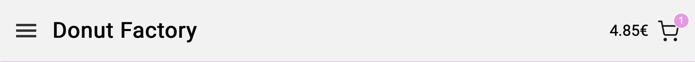

# Webshop - Donut Factory (Assignment in JavaScript-basic course)

#### This webshop is made as an assignment in the JavaScript-basic course.
Webbshoppen är inte aktiv och fungerar inte att beställa från. The webshop is not active and can't be ordered from.

#### Content
I have during this assignment been using following components:

- JavaScript 
- HTML 
- CSS (Sass)

#### Website structure
The webshop is built as one page but has different views sliding in from above and from the side. 

1. First there is a header, with a burger menu on the left and on the right side you can see the total amount and a button (icon) looking like a shoppingcart. 
2. Below you can see the products available in the webshop. There you can choose the quantity of donuts you want and add them to the shoppingcart. 
3. To get an overview of the order, you can click on the shoppingcart and see a compilation of the donuts you have chosen. 
4. When ready to order you click on the check out button in the shopping cart. 
5. You will then get to a view with a form, there you have to fill out your shipping detailjs. 
6. If the form is correct filled you will be able to press Next and you will get to a new view. 
7. In the new view you have to choose if you want to pay with card or invoice. When that's filled out correct you will be able to press Next to get to the last step. Here you can also choose to press previous and get back to the shipping form. 
8. If you press next you will get to the last view and also the last step. Here you can see order details such as, which donut, quantity and also price you want to order. You will also see the subtotal, if there is any discounts, shipping cost and the grandtotal. You also have the opportunity to add a discount code. 
9. . Here you can also choose to press previous and get back to the payment detalis or you can press reset all, if you do so you will get a choice if you want to start over (everything will be removed from the form and shoppingcart) or if you just want to reset the forms. 
10. The last and final step is to accept our cinditions (you will not be able to press place order before you do so) and then you press place order and it will pop up a 'Thank you for your order' - message. 

#### Screenshot of the website 

#### Image credits - Rawpixel

- https://www.rawpixel.com/search/donut%20top%20view?page=1&path=_topics%7Ctags_or-%24png&sort=curated

- https://www.rawpixel.com/search/donut?page=1&path=_topics%7Ctags_or-%24png&sort=curated

